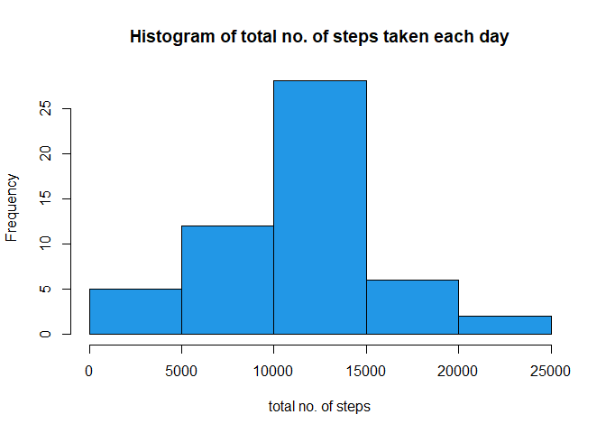

```r
library(dplyr)
```

```
## 
## Attaching package: 'dplyr'
```

```
## The following objects are masked from 'package:stats':
## 
##     filter, lag
```

```
## The following objects are masked from 'package:base':
## 
##     intersect, setdiff, setequal, union
```

```r
library(ggplot2)
```

```
## Warning: package 'ggplot2' was built under R version 4.0.3
```

```r
library(tidyr)
library(lubridate)
```

```
## 
## Attaching package: 'lubridate'
```

```
## The following objects are masked from 'package:base':
## 
##     date, intersect, setdiff, union
```


## Loading and preprocessing the data

```r
data1 <- read.csv("activity.csv", header = TRUE)
data1[,"date"] <- as.Date(data1[,"date"])
```


## What is mean total number of steps taken per day?

```r
## histogram of the total no of steps taken each day
data <- group_by(data1, date)
data <- summarise(data, total =sum(steps, na.rm = FALSE))
```

```
## `summarise()` ungrouping output (override with `.groups` argument)
```

```r
hist(data$total, col = 4, main = "Histogram of total no. of steps taken each day",
     xlab = "total no. of steps")
```

<!-- -->

```r
## mean and median of each day
summary(data)
```

```
##       date                total      
##  Min.   :2012-10-01   Min.   :   41  
##  1st Qu.:2012-10-16   1st Qu.: 8841  
##  Median :2012-10-31   Median :10765  
##  Mean   :2012-10-31   Mean   :10766  
##  3rd Qu.:2012-11-15   3rd Qu.:13294  
##  Max.   :2012-11-30   Max.   :21194  
##                       NA's   :8
```


## What is the average daily activity pattern?

```r
# Make a time series plot (i.e. type = "l") of the 5-minute interval (x-axis) and the average number of steps taken, averaged across all days (y-axis)
data2 <- group_by(data1, date)
data3 <- aggregate(steps~interval, data1, mean)
with(data3, plot(y = steps, x = interval,
                 type= "l", xlab = "5 - minute interval", ylab = "avg. no. of steps taken"))
```

<!-- -->

```r
# 
# Which 5-minute interval, on average across all the days in the dataset, contains the maximum number of steps?
maximum <- which.max(data3[,"steps"])
print(data3[maximum,])
```

```
##     interval    steps
## 104      835 206.1698
```


## Imputing missing values

```r
# the total number of missing values in the dataset
sum(is.na(data1))
```

```
## [1] 2304
```

```r
# a strategy for filling missing values is to fill it with mean of that 5 minute interval
# data_imputed is new dataset 
data_imputed <- data1
for (i in 1:nrow(data_imputed)) {
  if (is.na(data_imputed$steps[i])) {
    interval_value <- data_imputed$interval[i]
    steps_value <- data3[
      data3$interval == interval_value,]
    data_imputed$steps[i] <- steps_value$steps
  }
}

#histogram 
data_imputed2 <- aggregate(steps ~ date, data_imputed, sum)

hist(data_imputed2$steps, col = 5, main = "Histogram of total no. of steps taken each day(imputed)",
     xlab = "total no. of steps")
```

<!-- -->

```r
data_imputed2[,"date"]<- as.Date(data_imputed2[,"date"])
summary(data_imputed2)
```

```
##       date                steps      
##  Min.   :2012-10-01   Min.   :   41  
##  1st Qu.:2012-10-16   1st Qu.: 9819  
##  Median :2012-10-31   Median :10766  
##  Mean   :2012-10-31   Mean   :10766  
##  3rd Qu.:2012-11-15   3rd Qu.:12811  
##  Max.   :2012-11-30   Max.   :21194
```

```r
summary(data)
```

```
##       date                total      
##  Min.   :2012-10-01   Min.   :   41  
##  1st Qu.:2012-10-16   1st Qu.: 8841  
##  Median :2012-10-31   Median :10765  
##  Mean   :2012-10-31   Mean   :10766  
##  3rd Qu.:2012-11-15   3rd Qu.:13294  
##  Max.   :2012-11-30   Max.   :21194  
##                       NA's   :8
```


## Are there differences in activity patterns between weekdays and weekends?

```r
day <- data.frame(wday(data_imputed[,"date"]))
week <-factor()
for (i in 1:nrow(day)) {
  if (day[i,1] == "1" | day[i,1] == "7"){
    week <- rbind(week,"weekend")
  }
  else {
    week <- rbind(week, "weekday")
  }
  
}
week <- as.data.frame(week)
colnames(week) <- "week"
data_imputed <- cbind(data_imputed, week)

d1 <- aggregate(steps~interval + week, data_imputed, mean)

# create a plot
qplot(interval, 
      steps, 
      data = d1, 
      type = 'l', 
      geom=c("line"),
      xlab = "Interval", 
      ylab = "Number of steps", 
      main = "") +
  facet_wrap(~ week, ncol = 1)
```

<!-- -->

